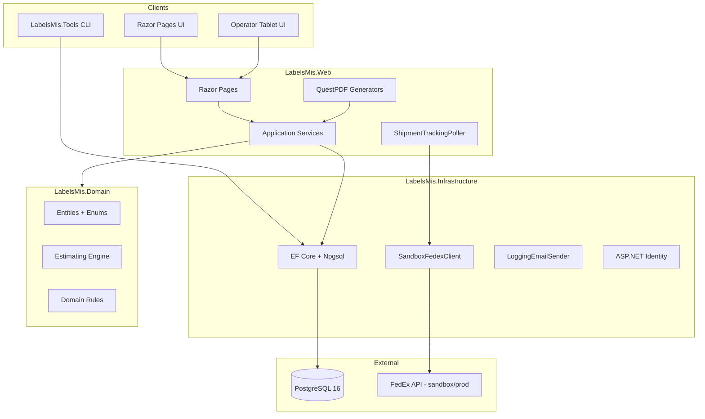

# Labels MIS — System Architecture

Tier 1 stack for a narrow-web label shop MIS (6 users, HP Indigo 6800).

## Layer rules

- **Domain** — business entities, estimating engine, FedEx/Email interfaces. No EF, no HTTP.
- **Infrastructure** — EF DbContext, migrations, external clients.
- **Web** — Razor Pages, services, PDF, background workers.
- **Tools** — CSV importers for cutover (no UI).

## Document numbering

Year-sequenced via `DocumentSequence` table: EST, SO, JOB, PO, SHP, INV, ROLL barcodes.

## Equipment polymorphism (JobOperation)

`JobOperation.EquipmentType` + `EquipmentId` discriminates Press vs FinishingOperation. Pack/Ship/Inspection use `EquipmentType.None`.
