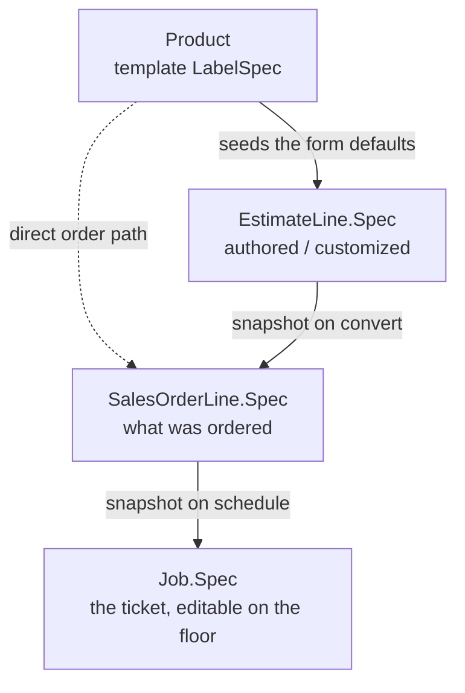

# LabelSpec Refactor — Design

Make the physical description of a label a first-class, **snapshotted** value that travels
estimate → sales order → job, instead of being scattered across `EstimateLine`, `Product`, and
reconstructed on demand by every downstream stage.

Status: **core implemented** (2026-07-04). Snapshot data model, wiring, and backfill are done and
verified; the editable spec UI (§8.1) and the Product template / EstimateLine consolidation (§9 step 1–2)
remain. See "Implementation status" at the bottom.

---

## 1. Why

Today a line's *spec* (dimensions, substrate, inks, spots, finishing, waste, layout) has no durable
home. Each stage reaches **backward** to reconstruct it, and the reach-back is lossy.

Evidence in the current code:

- **`Product` is a lossy projection of `EstimateLine`.** `EstimateLine` carries gutters, bleed,
  `SpotsJson`, white hits/coverage, and waste; `Product` does **not**. So the moment an estimate
  becomes a product/order, spots/white/bleed/gutters the customer was quoted are unrecoverable
  downstream.
- **`SalesOrderLine` carries no spec at all** — only `ProductId`, `SourceEstimateLineId`, qty, price.
- **`Job` rebuilds operations by reaching back.** `JobService.ResolveFinishingOperationsJsonAsync`
  (`JobService.cs:737`) tries the product's finishing JSON, then falls back through
  `sourceEstimateLineId` and `product.SourceEstimateLineId` into `EstimateLine`. That helper is a
  symptom of the missing model.
- **The reach-back link is fragile.** `SalesOrderLine.SourceEstimateLineId` gets wiped on a normal
  order save (the edit form rebuilds lines from page input). Observed live on `SO-2026-00013`:
  finishing rendered as "None" because the product's finishing was `[]` and the estimate-line link
  was gone.

The fix is not more fallback chains. It's to **own** the spec and **copy it forward** at each
contractual boundary.

---

## 2. Target model

Introduce a `LabelSpec` value object (EF **owned type**) holding the physical spec only. Every stage
keeps its **own copy**, so each can diverge from the one before it — which matches how a print shop
actually works (an order is a contract; a job ticket is the shop-floor contract; both must stay
stable even if the product template changes next month).



- **Product is a stamp; LabelSpec is the impression it leaves.** Product seeds a form; the
  customizations happen on the line, not back on the product.
- Each arrow is a **copy**. Editing a product later does not ripple into existing
  estimates/orders/jobs.
- Two entry points, same mechanics:
  - **From an estimate:** `EstimateLine.Spec → SalesOrderLine.Spec → Job.Spec`.
  - **Direct order** (`/sales-orders/new`, no estimate): `Product → SalesOrderLine.Spec → Job.Spec`.

### Snapshot points (confirmed)

| Boundary | Action |
|---|---|
| Pull product into estimate/order form | Seed `LabelSpec` from `Product.SpecTemplate` (defaults, overridable) |
| Estimate → Sales order (`CreateFromEstimateAsync`) | Copy `EstimateLine.Spec` → `SalesOrderLine.Spec` |
| Sales order → Job (`ScheduleFromSalesOrderAsync`) | Copy `SalesOrderLine.Spec` → `Job.Spec` |
| Production edits the ticket | Mutate `Job.Spec` only — order untouched |

Spec lives in **three** places (estimate line, order line, job), plus the **template** on product.

---

## 3. What `LabelSpec` contains

The physical description — the "spec vs. wrapper" split. Everything here is what the label *is*;
commercial and planning fields stay on their respective wrappers.

```
LabelSpec (owned value object)
  Dimensions:   LabelAcrossIn, LabelAroundIn, CornerRadiusIn,
                GutterAcrossIn, GutterAroundIn, BleedIn
  Material:     SubstrateId (Guid), DieId (Guid?)
  Color:        InkSet, WhiteHits, WhiteCoveragePct, SpotsJson (jsonb)
  Finishing:    FinishingOperationsJson (jsonb)
  Waste:        SetupWasteImpressions, RunningWastePct
  Layout:       MaxLabelsAcrossOverride?, LabelOrientationOverride?
```

**Stays on the wrapper (not spec):**

- `EstimateLine`: `MarkupPctOverride` (pricing), `QuantityBreaks`, cost breakdown, `LineNumber`,
  `ProductDescription`, `LineNotes`.
- `SalesOrderLine`: `Quantity`, `UnitPrice`, `LineTotal`, `LineNotes`, `SourceEstimateLineId`.
- `Job`: `QuantityOrdered`, `QuantityPlanned`, schedule/press/status, `Operations`.

**Artwork (snapshotted — decided):**

- `LabelSpec` carries `ArtworkFilePath` (the storage key). Artwork keys are already timestamped and
  unique per upload (`{prefix}{productId}/{yyyyMMddHHmmss}{ext}`), so pinning the key gives a job the
  exact art it ran. **Change required:** `ArtworkService` currently *deletes* the prior file on
  re-upload — stop deleting so old versions persist and snapshots don't dangle. Product points at the
  latest key; each snapshot pins its own.

`SubstrateId`/`DieId` are held as **plain Guids** inside the owned type; the owner entity exposes the
`Substrate`/`Die` navigations if needed. (EF owned types don't model FK navigations cleanly — resolve
by id at read time, as the code already does for finishing operations.)

---

## 4. Where it lives (ownership)

| Holder | Field | Meaning | Mutable? |
|---|---|---|---|
| `Product` | `SpecTemplate : LabelSpec` | Reusable defaults, seeds forms | Via product edit only; no ripple |
| `EstimateLine` | `Spec : LabelSpec` | Quoted spec | While estimate is a draft/revision |
| `SalesOrderLine` | `Spec : LabelSpec` | Ordered spec | While order is `Open` |
| `Job` | `Spec : LabelSpec` | Ticket spec | On the floor, per production rules |

`Product` gains a full `SpecTemplate` and loses its scattered spec columns (they move into the owned
type). It stays a lightweight catalog record: identity (`InternalSku`, `CustomerSku`), customer
assignments, artwork, status — plus the template.

---

## 5. EF mapping notes

- Map `LabelSpec` with `OwnsOne` on each of the four owners. (No `OwnsOne` precedent in the codebase
  yet — this establishes the pattern.)
- Owned columns default to a `Spec_` prefix. **Override column names** so that on `EstimateLine`
  (and `Product`) the existing columns are *reused* — the migration becomes a code reshuffle, not a
  data move, for those two tables.
- Reuse existing precision helpers: `HasDimensionPrecision()`, `HasMoneyPrecision()`,
  `HasQuantityPrecision()`, `HasPrecision(18,4)`.
- Keep `SpotsJson` / `FinishingOperationsJson` as `jsonb`, `IsRequired()`, defaulting to `"[]"`.
- `LabelSpec` lives in `LabelsMis.Domain` (a POCO value object, no EF dependency) so the estimating
  engine can keep operating on it without referencing Infrastructure.

---

## 6. Service wiring changes

**`SalesOrderService.CreateFromEstimateAsync`** — when building each `SalesOrderLine`, copy
`estimateLine.Spec` into the new line's `Spec`. (Product is still ensured for identity/artwork, but no
longer the spec source of truth.)

**`SalesOrderService.UpdateAsync` / `BuildLines`** — persist `Spec` through the edit round-trip
(today it rebuilds lines from page input; the page input must carry the spec, or edits are restricted
to the wrapper and spec is loaded from the tracked line). See §8 — do we let CSRs edit order spec, or
only view it?

**Direct order (`/sales-orders/new`)** — when a product is chosen on a line, seed
`SalesOrderLine.Spec` from `Product.SpecTemplate`.

**`JobService.ScheduleFromSalesOrderAsync`** — copy `salesOrderLine.Spec` into `Job.Spec` at
creation.

**`JobService.BuildOperationsAsync`** — read finishing from `job.Spec.FinishingOperationsJson`
directly. **Delete `ResolveFinishingOperationsJsonAsync` and `IsEmptyJsonArray`.**

**Display** — SO edit page, job detail, and the ticket read from `…​.Spec`. The current
`Edit.cshtml.cs` `LoadLineDetailsAsync` reach-back/match-by-product logic is deleted; it just reads
`SalesOrderLine.Spec`.

---

## 7. Migration & backfill

Two schema moves plus one data backfill.

1. **`EstimateLine` / `Product`** — restructure existing spec columns into the owned type with
   name overrides. No data movement if names are preserved. `Product` gains the columns it was
   missing (gutters, bleed, spots, white, waste) with sensible defaults (`"[]"`, `0`).

2. **`SalesOrderLine.Spec` + `Job.Spec`** — add the owned columns (new).

3. **Backfill existing rows** (one-time, EF migration or `LabelsMis.Tools` script):
   - For each `SalesOrderLine`: source spec from its `SourceEstimateLineId` estimate line if
     present; else from the order's `SourceEstimateId` estimate matched by product
     (`estimateLine.SourceProductId == line.ProductId`); else from `Product`. This is exactly the
     resolution we hand-rolled for the `SO-2026-00013` display fix — run it once, persist it.
   - For each `Job`: source from its `SalesOrderLine.Spec` (post-backfill), else same chain.

   `SO-2026-00013` is the canonical test row: after backfill its line spec should carry the two
   finishing ops (`12-OZ-CAN-DIE-CUT`, `5-MIL-LAM`) that live on estimate `EST-2026-00010`.

---

## 8. Decisions (resolved)

1. **Order-line spec is editable.** CSRs can edit the ordered spec on the SO page while the order is
   `Open`; the SO page input carries the full spec. (Large UI item — sequenced after the data model
   and snapshot wiring land; see §9.)
2. **Artwork is snapshotted** into `LabelSpec.ArtworkFilePath`; stop deleting prior files on
   re-upload (see §3).
3. **Layout overrides live in `LabelSpec`** (`MaxLabelsAcrossOverride`, `LabelOrientationOverride`).
4. **Backfill runs as a `LabelsMis.Tools` command** (explicit and reviewable, matching the CSV
   importer precedent), not an automatic EF migration.

Mapping note: the existing value-object precedent (`ShippingAddress`) is *manually flattened*, not
`OwnsOne`. `LabelSpec` deliberately introduces `OwnsOne` — cleaner across four owners than hand-rolled
flattening.

---

## 9. Rollout (incremental, each step shippable)

1. Introduce `LabelSpec` value object; make `EstimateLine` own it (column-name-preserving reshuffle).
   No behavior change.
2. Add `SpecTemplate` to `Product`; seed estimate/order forms from it. Product edit writes the
   template.
3. Add `Spec` to `SalesOrderLine`; populate on convert + direct order; backfill existing rows;
   repoint SO display at `.Spec`; drop the reach-back display code.
4. Add `Spec` to `Job`; populate on schedule; repoint `BuildOperationsAsync` + ticket at `.Spec`;
   delete `ResolveFinishingOperationsJsonAsync`. Enable on-the-floor spec edits per decision §8.1.

---

## 10. Non-goals

- Not changing the estimating engine's calculation logic — only where its inputs are stored.
- Not merging estimate/order/job line *wrappers* into one entity (they have genuinely different
  commercial/planning concerns; only the **spec** is shared).
- Not using inheritance (`OrderLine : EstimateLine`) — they share fields, not identity or behavior.

---

## 11. Implementation status (2026-07-04)

**Done and verified:**

- `LabelSpec` value object (`Domain/ValueObjects/LabelSpec.cs`) with `EstimateLine.ToLabelSpec()` and
  `Product.ToLabelSpec()` mappers.
- `SalesOrderLine.Spec` and `Job.Spec` as optional owned types (`OwnsLabelSpec` EF helper, `Spec*`
  columns, migrations `AddSalesOrderLineSpec` + `AddJobSpec`).
- Snapshot wiring: estimate→order (`CreateFromEstimateAsync`), direct order seed from product
  (`CreateAsync`/`UpdateAsync` via product templates), order→job (`ScheduleFromSalesOrderAsync`).
  Spec round-trips through the SO edit form as a hidden field so saves preserve it.
- Job build reads `job.Spec.FinishingOperationsJson`; `ResolveFinishingOperationsJsonAsync` and
  `IsEmptyJsonArray` deleted.
- SO edit line-details read `line.Spec` (product-template fallback for un-backfilled rows); the
  estimate-line reach-back/match-by-product code is gone.
- Artwork: `ArtworkService` no longer deletes prior files on re-upload; `LabelSpec.ArtworkFilePath`
  carries the pinned key.
- Backfill: `LabelsMis.Tools backfill-specs` — ran on dev DB (29 rows). `SO-2026-00013` now carries
  its two finishing ops (`12-OZ-CAN-DIE-CUT`, `5-MIL-LAM`) in its line spec.

**Remaining:**

- **Editable spec UI on the SO page** (§8.1) — the fields exist on `Spec` and round-trip; the inputs
  to edit them while the order is Open are not built yet.
- **Product `SpecTemplate` + `EstimateLine` owns `LabelSpec`** (§9 steps 1–2) — consolidation cleanup.
- **Job detail / ticket** — `job.Spec` is populated but the job page and ticket still read
  `job.Product.*`; repointing them (and rendering the full spec on the ticket) is the deferred
  "other places" work.

> **Decision (2026-07-05):** stopping here for now. The core refactor is considered done — the three
> remaining items above are intentionally deferred, not in-progress. Pick them up later if/when the
> editable-spec or richer-ticket needs become real.
