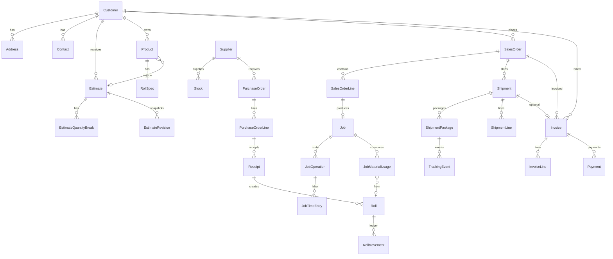

# Schema ERD (Tier 1)

Aging calculated from **InvoiceDate**, not DueDate.

```mermaid
erDiagram
    Customer ||--o{ Address : has
    Customer ||--o{ Contact : has
    Customer ||--o{ Estimate : receives
    Customer ||--o{ Product : owns
    Customer ||--o{ SalesOrder : places
    Customer ||--o{ Invoice : billed

    Estimate ||--o{ EstimateQuantityBreak : has
    Estimate ||--o{ EstimateRevision : snapshots
    Product ||--o| RollSpec : has
    Product }o--o| Estimate : source

    SalesOrder ||--o{ SalesOrderLine : contains
    SalesOrderLine ||--o| Job : produces
    Job ||--o{ JobOperation : route
    JobOperation ||--o{ JobTimeEntry : labor
    Job ||--o{ JobMaterialUsage : consumes
    JobMaterialUsage }o--o| Roll : from

    Supplier ||--o{ Stock : supplies
    Supplier ||--o{ PurchaseOrder : receives
    PurchaseOrder ||--o{ PurchaseOrderLine : lines
    PurchaseOrderLine ||--o{ Receipt : receipts
    Receipt ||--o{ Roll : creates
    Roll ||--o{ RollMovement : ledger

    SalesOrder ||--o{ Shipment : ships
    Shipment ||--o{ ShipmentPackage : packages
    ShipmentPackage ||--o{ TrackingEvent : events
    Shipment ||--o{ ShipmentLine : lines

    SalesOrder ||--o{ Invoice : invoiced
    Shipment ||--o| Invoice : optional
    Invoice ||--o{ InvoiceLine : lines
    Invoice ||--o{ Payment : payments
```

See `src/LabelsMis.Infrastructure/Migrations/` for authoritative schema.
